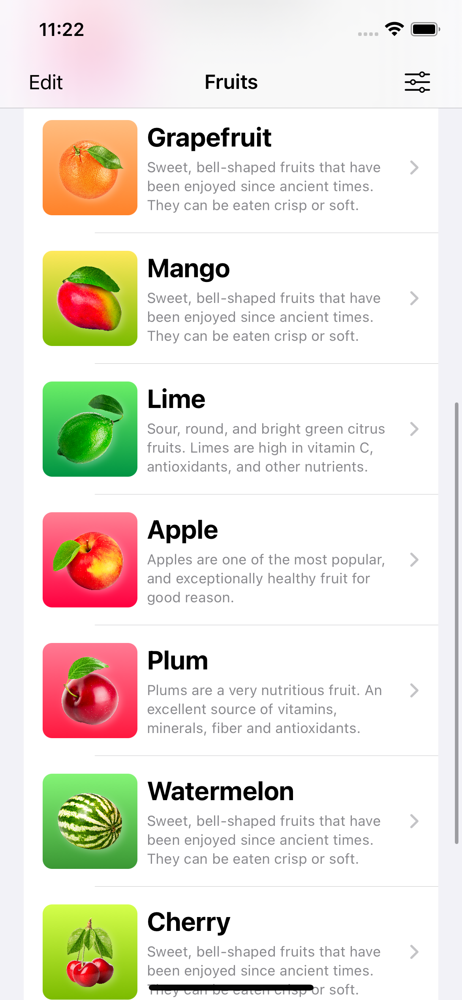

## Fruits

### A fruit dictionary iOS app made with Swift and SwiftUI

<table>
<tr>
<td>Preview</td>
<td>OnBoarding Screen</td>
</tr>
<tr>
<td></td>
<td></td>
</tr>
<tr>
<td>List Screen</td>
</tr>
<tr>
<td></td>
<td></td>
</tr>
<tr>
<td>Details Screen</td>
<td>Settings Screen</td>
</tr>
<tr>
<td></td>
<td></td>
</tr>
</table>

